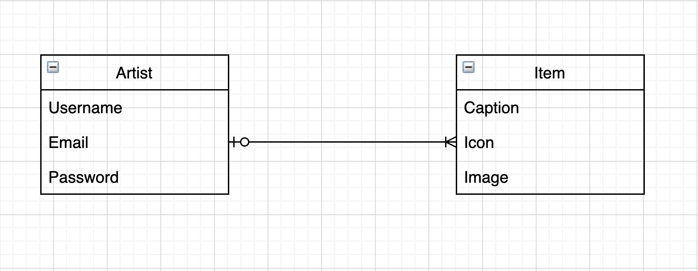

# Shopify Image Hub
Shopify Challenge Backend Internship 2021

## How to Use App
1. Please follow the link: [Live Link here](https://shopify-image-hub-2021.herokuapp.com/)
2. Create an account
3. Post your favorite images

## Tech Stack
- PostgreSQL
- Django
- Python
- Jinja Templating Engine

## Entity Relation Diagram

| Features                                   | ☑ Done ️   |
| ------------------------------------------ | :------:  |
| A user can create an account               |     ☑     |
| A user can login into their account        |     ☑     |
| A user can logout of their account         |     ☑     |
| Only a user can add images to the repo     |     ☑     |
| Users can only delete their images         |     ☑     |

